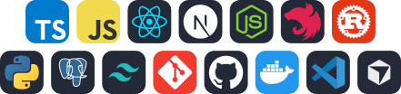
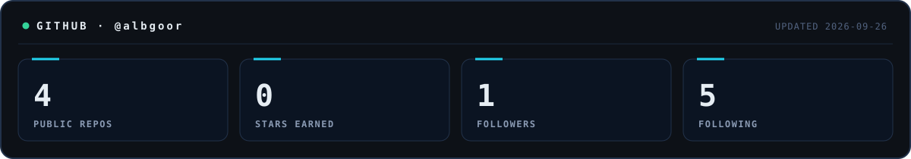
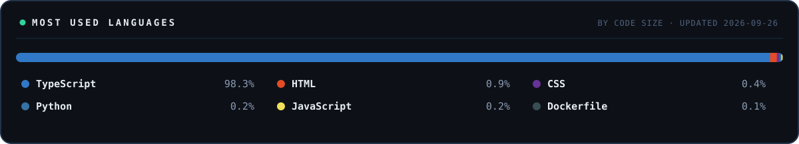

<picture>
  <source media="(prefers-color-scheme: dark)" srcset="assets/profile-terminal-dark.svg">
  <source media="(prefers-color-scheme: light)" srcset="assets/profile-terminal-light.svg">
  
</picture>

 

<h2 align="center">THE MAN BEHIND THE CODE</h2>

<strong>Full Stack Developer building ERP, logistics and interactive 3D systems: software that has to survive contact with the real world.</strong>

I'm **Yaseen Mohammad**, based in Amman, Jordan. I work across the whole stack: React and Next.js on the front, Node.js and NestJS on the back, PostgreSQL and Redis underneath. The work I care about most is where software meets operations: warehouses, terminals, gates, manifests, and the dashboards people rely on every day.

I like hard problems and I don't drop them halfway. When something breaks, I get back up, find out why, and ship the fix. That's the whole philosophy: build real things, keep raising the bar, and let the work speak.

<table>
  <tr>
    <td width="33%" valign="top">
      <code>01</code> <strong>FULL-STACK PLATFORMS</strong>  
      Next.js, NestJS and TypeScript. REST APIs, authentication, RBAC, dashboards, reporting and operational workflows.
    </td>
    <td width="33%" valign="top">
      <code>02</code> <strong>ERP &amp; LOGISTICS</strong>  
      Terminal operations, warehouse management, transportation workflows, gate processes, manifests, permits and operational reporting.
    </td>
    <td width="33%" valign="top">
      <code>03</code> <strong>INTERACTIVE 3D</strong>  
      Three.js, React Three Fiber and Blender. Yard visualization, vehicle placement, WebGL and VR-oriented interfaces.
    </td>
  </tr>
</table>

 

<h2 align="center">BUILT WITH</h2>

<picture>
  <source media="(prefers-color-scheme: dark)" srcset="assets/built-with-dark.svg">
  <source media="(prefers-color-scheme: light)" srcset="assets/built-with-light.svg">
  
</picture>

<code>LANGUAGES</code> TypeScript · JavaScript · Rust · Python &nbsp; <code>FRONTEND</code> React · Next.js · Tailwind 
<code>BACKEND</code> Node.js · NestJS · PostgreSQL &nbsp; <code>SHIP</code> Git · GitHub · Docker · VS Code · Cursor

 

<h2 align="center">MY EDGE</h2>

<picture>
  <source media="(prefers-color-scheme: dark)" srcset="assets/edge-radar-dark.svg">
  <source media="(prefers-color-scheme: light)" srcset="assets/edge-radar-light.svg">
  
</picture>

 

<h2 align="center">LET THE NUMBERS TALK</h2>

<picture>
  <source media="(prefers-color-scheme: dark)" srcset="assets/stats-dark.svg">
  <source media="(prefers-color-scheme: light)" srcset="assets/stats-light.svg">
  
</picture>

<picture>
  <source media="(prefers-color-scheme: dark)" srcset="assets/languages-dark.svg">
  <source media="(prefers-color-scheme: light)" srcset="assets/languages-light.svg">
  
</picture>

Real numbers from the GitHub API, refreshed daily by a scheduled workflow. Metrics that can't be fetched reliably are left out, never estimated.

 

<code>WATCH ME BUILD · @albgoor</code>

