<div align="center">

<picture>
  <source media="(prefers-color-scheme: dark)" srcset="assets/profile-terminal-dark.svg">
  <source media="(prefers-color-scheme: light)" srcset="assets/profile-terminal-light.svg">
  
</picture>

<a href="https://git.io/typing-svg"></a>

<a href="https://www.linkedin.com/in/albgoor"></a>
<a href="https://github.com/albgoor"></a>


</div>

---

## About Me

I'm **Yaseen Mohammad**, a Full-Stack Developer based in Amman, Jordan, focused on building software that connects digital systems with real-world operations.

I work across frontend, backend, databases, infrastructure and interactive 3D experiences, with a focus on logistics platforms, terminal operations, warehouse workflows, ERP systems and operational visualization.

## Core Stack

<div align="center">


<br>


</div>

---

## What I Build

<table>
  <tr>
    <td width="33%" valign="top">
      <strong>FULL-STACK PLATFORMS</strong><br><br>
      Next.js, NestJS, TypeScript, REST APIs, authentication, RBAC, dashboards, reporting, and operational workflows.
    </td>
    <td width="33%" valign="top">
      <strong>LOGISTICS &amp; ERP</strong><br><br>
      Terminal operations, warehouse management, transportation workflows, gate processes, manifests, permits, and operational reporting.
    </td>
    <td width="33%" valign="top">
      <strong>INTERACTIVE 3D</strong><br><br>
      Three.js, React Three Fiber, Blender assets, yard visualization, vehicle placement, WebGL, and VR-oriented interfaces.
    </td>
  </tr>
</table>

---

## `SYSTEM.CAPABILITIES`

| Module | Capabilities |
|:--|:--|
| `FRONTEND` | Next.js · React · TypeScript · Tailwind CSS |
| `BACKEND` | NestJS · Node.js · REST APIs · Prisma |
| `DATA` | PostgreSQL · Redis |
| `OPERATIONS` | Docker · Git · GitHub |
| `3D ENGINE` | Three.js · React Three Fiber · Blender · WebGL · VR |
| `DOMAIN` | Logistics · ERP · WMS · Terminal Operations |

---

## `CURRENT.FOCUS`

```text
01  Scalable Full-Stack Systems      04  Interactive 3D Operations
02  Logistics & Terminal Software    05  Performance & Clean Architecture
03  Warehouse Management Workflows   06  AI-Assisted Development
```

---

## GitHub Signals

<div align="center">

<a href="https://github.com/albgoor">
  <picture>
    <source media="(prefers-color-scheme: dark)" srcset="https://github-readme-stats.vercel.app/api?username=albgoor&amp;show_icons=true&amp;hide_border=true&amp;theme=github_dark&amp;bg_color=00000000&amp;rank_icon=github">
    <source media="(prefers-color-scheme: light)" srcset="https://github-readme-stats.vercel.app/api?username=albgoor&amp;show_icons=true&amp;hide_border=true&amp;theme=default&amp;bg_color=00000000&amp;rank_icon=github">
    
  </picture>
</a>
<a href="https://github.com/albgoor?tab=repositories">
  <picture>
    <source media="(prefers-color-scheme: dark)" srcset="https://github-readme-stats.vercel.app/api/top-langs/?username=albgoor&amp;layout=compact&amp;langs_count=8&amp;hide_border=true&amp;theme=github_dark&amp;bg_color=00000000">
    <source media="(prefers-color-scheme: light)" srcset="https://github-readme-stats.vercel.app/api/top-langs/?username=albgoor&amp;layout=compact&amp;langs_count=8&amp;hide_border=true&amp;theme=default&amp;bg_color=00000000">
    
  </picture>
</a>

<sub>Cards are rendered live from public GitHub data by the community-hosted github-readme-stats service and may be briefly unavailable when it is rate-limited.</sub>

</div>

---

<div align="center">

<code>BUILD · LEARN · SHIP · @albgoor</code>

</div>
